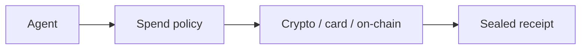

# Sumit Shinde

Agents that can spend — with identity, policy, and an audit trail.

[aipaysdk.com](https://aipaysdk.com) · Singapore · AgntPymt

---

I build the payment layer autonomous agents actually need: wallets, spend policy, settlement, and receipts — not a checkout form bolted onto an LLM.

## Featured work

<table>
  <tr>
    <td width="50%">
      
    </td>
    <td width="50%">
      
    </td>
  </tr>
  <tr>
    <td width="50%">
      
    </td>
    <td width="50%">
      
    </td>
  </tr>
</table>

| Project | What it is |
| --- | --- |
| [**AIPaySDK**](https://github.com/SumitShinde0702/aipaysdk) | Chain-agnostic SDK for agent identity, spend limits, and settlement. Site: [aipaysdk.com](https://aipaysdk.com) |
| [**GateX**](https://github.com/SumitShinde0702/AgentixPlayground) | Agents that buy without being hijacked — policy, Ed25519 identity, CaMeL isolation, StraitsX XSGD cards, x402 on Avalanche. [Live demo](https://main.db3ju8bxs5af1.amplifyapp.com/) |
| [**ATMS**](https://github.com/SumitShinde0702/ATMS) | Agentic treasury management — markets, swaps, compliance. |
| [**AgntPymt**](https://github.com/SumitShinde0702/AgntPymt) | The company surface for agent-native payments. |

## Stack

## GitHub

## Contribution snake

The animation below is generated daily from my contribution graph. It appears after the GitHub Action in this repo runs once.

<picture>
  <source media="(prefers-color-scheme: dark)" srcset="https://raw.githubusercontent.com/SumitShinde0702/SumitShinde0702/output/github-contribution-grid-snake-dark.svg" />
  <source media="(prefers-color-scheme: light)" srcset="https://raw.githubusercontent.com/SumitShinde0702/SumitShinde0702/output/github-contribution-grid-snake.svg" />
  
</picture>

